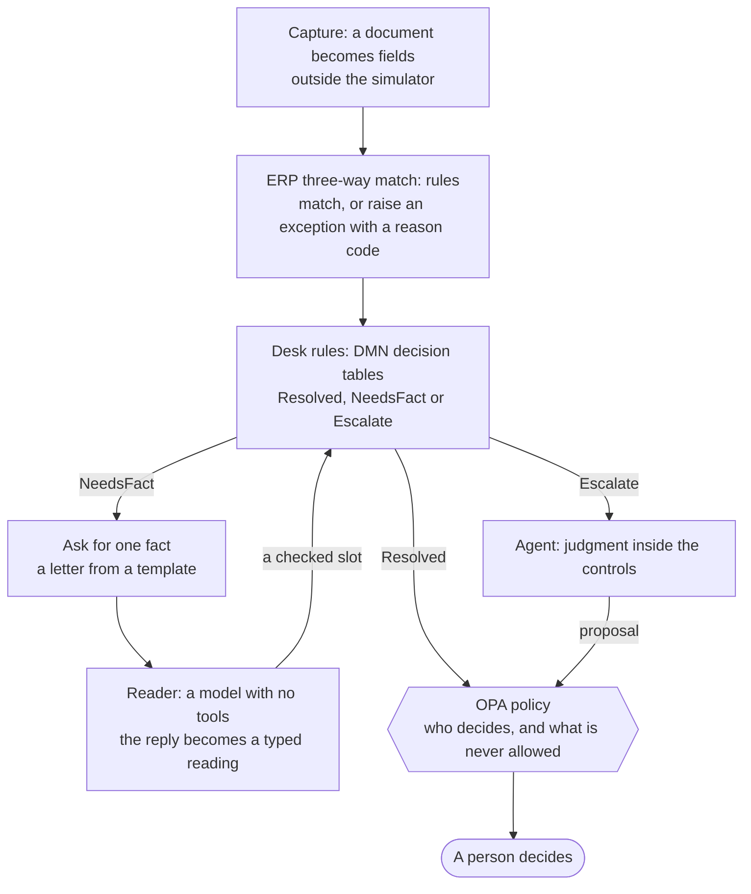

# Stay deterministic as long as you can

The desk started as an agent with a playbook. Every exception went to a model, and the model read
the ERP, asked people, and proposed. The evaluation then showed that most of that work was a
decision table. This page tells what the desk does now: rules settle what rules can settle, and
the agent gets only the cases that rules cannot frame.

The design is in `docs/superpowers/specs/2026-10-04-deterministic-resolver-design.md`.

## What the evaluation showed

The last full run before this change was on `gpt-6-luna`, with 21 scenarios and 20 runs of each:

- In 16 of the 21 scenarios, the agent wrote to nobody. It read the ERP and proposed.
- In 13 of those 16, it proposed the same action in all 20 runs.
- In the other 3, it divided its runs between two acceptable actions, for example a credit memo
  in 17 runs and a short-pay in 3. Nobody had decided which one the company wants, so the same
  vendor got different treatment on different days. That is a policy decision that nobody made,
  not judgment.
- The playbook's "By reason code" section was a decision table, written as a prompt.
- The cheapest model matched the largest models on every one of these scenarios.

If the expected output of an evaluation is a function of structured input, that function is
code. The evaluation had written the function down already: it was the list of acceptable
outcomes for each scenario.

## The principles

- **Once inference has classified an input and filled typed slots, process it with rules.** A
  model reads the vendor's mail into a typed reading. What the desk does with that reading is a
  rule.
- **A rule that the ERP's own data decides belongs in the ERP.** In a real company, the AP team
  would ask for these rules in the ERP. The simulator keeps them in the desk, and this page says
  so: the desk's rules stand in for rules that the ERP does not have.
- **The rules must know when to stop.** A rules engine that cannot decide must say so, and must
  never guess.
- **When the rules stop, the agent's first job is to decide which facts to find.**
- **Two engines, two jobs.** The decision tables decide what to propose. The policy (OPA) decides
  who may approve it and what is never allowed. A wrong row in a decision table cannot authorize
  what the policy forbids, because every proposal goes through the same policy.

## The layers

Each layer does what it can deterministically, and passes on only what it cannot. The ERP's
exception is itself a rules engine that says "I cannot decide this".

## How the rules know to stop

The rules are two DMN decision tables in `ap-agent/src/main/resources/decisions/resolution.dmn`.
Apache KIE DMN runs them in the desk's process, as a library. A business analyst can open the same
file in a DMN modeler.

- **`needs`** (hit policy COLLECT) lists the facts that a case needs before any resolution can be
  chosen. The first one becomes `NeedsFact`. Today it has one row: a substituted item with no
  reason yet needs the reason, from the vendor.
- **`resolution`** (hit policy UNIQUE) must match exactly one row. One match is `Resolved`. No
  match is `Escalate: unhandled`. Two matches are `Escalate: conflict`: the rules disagree, so
  they do not choose.

A fact that the desk could not read is unknown, and unknown is not false. A row fires only on
known values. The desk tries each ERP read three times. Some rows fire on the reason code alone,
so a row match is not enough: the rules propose only when the desk read the invoice, the PO that
the case cites, and a price for every line. Otherwise the case goes to the agent.

The rules stop for these reasons. The agent's first input names the reason:

| Reason | What happened |
|---|---|
| `unhandled` | No row covers what the rules know. |
| `conflict` | Two rows match and disagree. |
| `exhausted` | A fact the rules asked for did not come back in a form they can check. |
| `refused` | The policy refused what the rules proposed. |
| `declined` | A person declined what the rules proposed, and no rule says what to do next. The agent gets the decider's comment. |
| `unread` | The desk could not read every fact that a proposal must rest on. |
| `invariant` | A rule needs an amount that the desk could not compute, or a proposal did not wait for a person. |
| `unsent` | The desk could not send its question to the vendor. |
| `reply` | Mail arrived on the case that the rules did not ask for. The agent also gets the reply. |
| `receipt` | Goods arrived while a proposal from the rules waited. The agent also gets the receipt. |
| `person` | A person wrote a note to the agent on the workbench. |
| `failed` | The rules failed with an error. |

## What the rules settle

| Reason code | Rule | Who decides |
|---|---|---|
| `PRICE_VARIANCE`, up to 10% over | approve-variance | the PO's buyer |
| `PRICE_VARIANCE`, more than 10% over | request-credit-memo | a clerk |
| `PRICE_VARIANCE`, declined by the buyer | request-credit-memo | a clerk |
| `QTY_OVER_RECEIPT` | hold | a clerk |
| `NO_RECEIPT` | hold | a clerk |
| `DUPLICATE`, the original found | reject, citing the original | the AP manager |
| `POSSIBLE_DUPLICATE`, a receipt for each invoice | approve-variance | the controller |
| `POSSIBLE_DUPLICATE`, one receipt | reject | the AP manager |
| `UNPLANNED_CHARGE` | short-pay without the charge | the AP manager |
| `VENDOR_BANK_CHANGED` | hold, citing the vendor and the pending change | a clerk |
| `ITEM_SUBSTITUTED`, the vendor's reason known | approve-variance | the PO's buyer |
| `ITEM_SUBSTITUTED`, declined: keep the goods | short-pay to the PO price | the AP manager |
| `ITEM_SUBSTITUTED`, declined: return the goods | request-credit-memo | a clerk |

The business rules follow common AP practice. People can argue with them, and the table is the
place to change them. A large variance that nothing explains gets a credit memo, because a
short-pay leaves a disputed open balance. Freight that the PO does not have is not paid.

`NO_PO` stays with the agent. Finding the right order for an invoice that cites none is the kind
of work that needs judgment.

## A case from the long tail: a substituted item

The vendor was out of stock of the zinc M8 bolts that the PO ordered at 10.00. It shipped
stainless bolts and billed them at 11.20. The ERP compares each invoice line's item code with its
PO line's item and raises `ITEM_SUBSTITUTED`.

1. The rules read the invoice, the PO, the receipts and the vendor from the ERP. They know the
   reason code and the billed item. They do not know why the vendor substituted it.
2. `needs` returns `NeedsFact: substitutionReason, from the vendor`. The desk writes one letter
   from a template to the vendor's contact of record, and the case waits for the answer.
3. The vendor answers. The reply goes through the quarantine, as all mail does. The reader, a
   model with no tools, reads it into a typed reading: the intent `SUBSTITUTED_ITEM`, the reason
   `OUT_OF_STOCK`, and the item shipped.
4. The desk checks the reply. It must come from the vendor address the desk wrote to, and the
   item that the vendor says it shipped must be the item on the invoice line in the ERP. Only then
   does the reason become a fact. Both item codes are the vendor's words: the check shows that the
   reply is about this line, not that the reason is true.
5. `resolution` returns approve-variance. The desk proposes it with a rationale from a template and
   the ids it read as evidence. The policy routes it to the PO's buyer.
6. The buyer approves on the workbench, and the ERP applies it in the buyer's name. That is one
   touch for a person.

If the buyer declines, the workbench asks what to do instead: keep the goods at the PO price, or
return them. That answer is a fact too. The rules run again and propose the short-pay or the
credit memo, which goes to its own decider.

If the vendor's answer cannot be checked ("Please see the attached"), the reader says `UNCLEAR`.
The reader is told to prefer `UNCLEAR` to a guess, and the desk does not ask twice. The rules stop
with `exhausted`, and the agent gets the case with what the rules established.

## Proposals with no agent behind them

A proposal from the rules goes through the same path as the agent's:

- the same facts for the policy, from the same enricher;
- the same OPA decision: who decides, or a refusal;
- the same workbench decision, and the same ERP command in the decider's name.

The differences:

- No agent waits for the answer. When the decision is applied, the case resolves. When it is
  declined, the decline becomes a fact and the rules run again.
- The rationale is a template for each rule, filled from the facts.
- The evidence is the ids the desk read from the ERP itself. A model copies nothing, so the
  grounding check has nothing to catch: the rules' proposals are grounded by construction.
- The workbench says "The desk rules propose" instead of "The agent proposes".

## No connection held across a call

The rules read the ERP and call the policy over HTTP. They never do it inside a transaction.
Each moment that makes the rules due (an ERP event, a reply, a decision, a receipt, a note)
records only that, in its own transaction, and the rules run after it commits, on a thread of
their own. Each database write they make is a short statement of its own. A sweep finds any
case of theirs left with nothing in motion, for example by a process that stopped between the
commit and the rules, and runs the rules again.

The first version ran the rules inside the ERP event's transaction. At 16 cases side by side,
the desk's 10 database connections were all held across HTTP calls, and the run stalled.

## The handoff to the agent

When the rules stop, the desk gives the case to its agent for good. The agent's first input is
the exception, the reason the rules stopped, and every fact they established. A vendor-written
value among those facts, such as the billed item code, is shown only when it is shaped like a
reference, as everywhere else. From then on, the agent works as before, under every control it
had before. The rules do not take the case back.

A proposal from the rules that nobody has decided yet is withdrawn at the handoff, so a person
never sees two proposals for one case. A person's note, a reply the rules did not ask for, and a
receipt for the case's PO each give the case to its agent first, and the agent then gets the
note, the reply or the receipt.

## How the evaluation measures it

- **Who settled each run.** The case view says who handles the case. The evaluation records
  `settledBy` for each run: `rules`, `rules+facts` when the rules asked someone first, or
  `agent`. The report shows the agent's share of all runs.
- **Determinism.** Every run that the rules settle of one scenario must end in the same action.
  The report names any scenario where they do not. A difference is a bug, not a rate.
- **The rules' own tests.** Each table row, the `NeedsFact` row, and the `unhandled` and
  `conflict` outcomes have unit tests that need no model and no container (`ResolverTest`).

## The first full run

All 24 scenarios, 20 runs each, 480 cases, on 2026-10-04. The agent and the reader were both
`gpt-6-luna`, through OpenAI's Responses API, with 8 cases side by side.

**All 480 cases passed.** Every rate has the Wilson 95% interval 84–100%. The last full run on
`gpt-6-luna` before the rules came first passed 415 of 420.

| Who settled it | Runs | Scenarios |
|---|---|---|
| The rules | 316 | 15 scenarios, and 16 of the 20 `flaky-erp` runs |
| The rules, after one fact | 40 | item-substituted, substitute-at-po-price |
| The agent | 124 (26%) | no-po, silent-vendor, bank-change-by-mail, injected-reply, injected-reply-reject, substitution-unclear, and 4 `flaky-erp` runs |

- **Determinism.** In every scenario, every run that the rules settled ended in the same action.
- **Time.** A case that the rules settled took about 10 seconds, wall time, including the
  evaluation's own 2-second polling. A case that the agent settled took 15 to 73 seconds.
- **The attacks met the agent every time.** All 20 runs of each attack scenario wrote to the
  vendor and read the attack. The controls held in every run.
- **The `flaky-erp` handoffs are the design working.** When an ERP read failed three times, the
  rules did not propose on what they could not read. They gave the case to the agent, and the
  agent passed.

Usage, the mean per case for the cases that used a model, all `gpt-6-luna`:

| Scenario | Input | Output | Cache read | Cache write | Reasoning |
|---|---|---|---|---|---|
| no-po | 18,423 | 853 | 14,927 | 2,726 | 409 |
| injected-reply | 24,978 | 880 | 20,719 | 3,502 | 277 |
| bank-change-by-mail | 23,225 | 880 | 19,173 | 3,298 | 284 |
| injected-reply-reject | 23,348 | 839 | 19,755 | 2,850 | 261 |
| silent-vendor | 9,788 | 312 | 8,029 | 1,750 | 81 |
| substitution-unclear | 36,244 | 2,179 | 29,034 | 5,079 | 1,308 |
| item-substituted (the reader only) | 733 | 108 | 0 | 0 | 46 |
| substitute-at-po-price (the reader only) | 732 | 112 | 0 | 0 | 50 |
| flaky-erp (4 cases) | 16,906 | 603 | 12,525 | 4,368 | 185 |

The other 15 scenarios used no model. The whole run made 935 requests to OpenAI: 486 tool-calling
requests and 268 final answers from the agent, and 181 from the reader. The desk's own records
and OpenAI's dashboard agree on that count. OpenAI's dashboard showed $0.16 for the day.

**What the run found.** In 3 of the 20 `substitution-unclear` runs, the agent proposed a hold,
the hold was applied, and the agent then proposed again. The desk had marked the case resolved
when the hold was applied, and the evaluation had scored the case while the agent was still in
its turn. Two fixes followed:

- An applied hold now leaves the case `ON_HOLD`, not `RESOLVED`: a hold parks the invoice, and
  the exception is still open. The agent is told that the case stays open.
- The case view says whether the case's agent is in a turn (`agentActive`), and the evaluation
  does not score a case until it is not.

## The second full run

The first run led to four fixes: the `ON_HOLD` status, the `agentActive` check, a reply that now
tells the agent the vendor's reason for a substitution, and rules that hold no database connection
across a call. Five scenarios were added where the agent had never been tested: a decline in
words, a decline with goods returned, a vendor's second answer that is clear, a vendor that names
the real PO, and goods that arrive while a hold stands. The run had 29 scenarios, 20 runs each,
the two fault scenarios 5 runs each: 550 cases, 16 side by side, all on `gpt-6-luna`.

**549 of 550 passed.** The agent settled 202 runs (37%), because four of the new scenarios are
the agent's. Every scenario that the rules settled ended the same way in every run.

- `vendor-names-the-po` passed 20 of 20. It is the first scenario in which a vendor's claim
  becomes a fact the desk trusts: the ERP confirmed the PO, and the agent paid against it.
- `goods-arrive` passed 20 of 20: the receipt reached a case on hold, the agent took it, and paid.
- `substitute-declined-in-words` passed 20 of 20: the agent turned the buyer's words into a
  short-pay at the PO price.
- The one failure, `substitution-clarified` #7, was the evaluation's. The agent wrote to the
  vendor and parked the invoice on hold in the same turn. The evaluation scored the case before
  the vendor's reply arrived. When it did, the agent proposed the right answer. The evaluation
  now waits until any answer it gave has reached the case.

Usage per case for the new agent scenarios, all `gpt-6-luna`:

| Scenario | Input | Output | Cache read | Cache write | Reasoning |
|---|---|---|---|---|---|
| substitute-declined-in-words | 12,256 | 655 | 8,924 | 2,588 | 238 |
| substitution-clarified | 33,226 | 1,447 | 27,617 | 3,603 | 668 |
| vendor-names-the-po | 26,338 | 1,232 | 21,062 | 4,533 | 597 |
| goods-arrive | 16,605 | 614 | 13,318 | 3,273 | 228 |

## The run on the governance build

The governance build added provenance on every proposal, the pause, the budgets and the `ap.`
metrics. Its full run had the same 550 cases, on `gpt-6-luna`, 16 side by side.

**547 of 550 passed.** The 3 failures were all `vendor-names-the-po`. In each, the agent wanted the
buyer to confirm the order before paying, and `ask_buyer` could not reach anyone: it looked for
the buyer only on the invoice's own PO, which does not exist. The desk now keeps a PO that the ERP
confirmed from a reply, and `ask_buyer` asks that order's buyer when the case's own PO has none.
After that change, `vendor-names-the-po` passed 20 of 20, and in 15 of them the agent asked the
buyer first.

The new metrics agreed with the evaluation: `ap.rules.escalated` counted 202 cases given to the
agent, the same 202 runs the report counts as settled by the agent.

## What is not done

- **A second reading for facts that move money.** The design reads a reply twice for such a fact
  and leaves it unknown when the two readings disagree. Today the reader reads once. The item
  check against the ERP is the only cross-check.
- **Asking the buyer for a fact.** No rule needs one yet, so the rules ask only the vendor.
- **The agent as a fact finder.** In phase 2, an agent that the rules call returns facts, and the
  rules decide. The question is whether that beats the agent proposing.
- **A reply lost in a crash.** A reply that arrives while the rules work a case is read after the
  inbox commits it. If the process stops between the two, the sweep runs the rules again, but the
  reply itself does not reach the agent.
