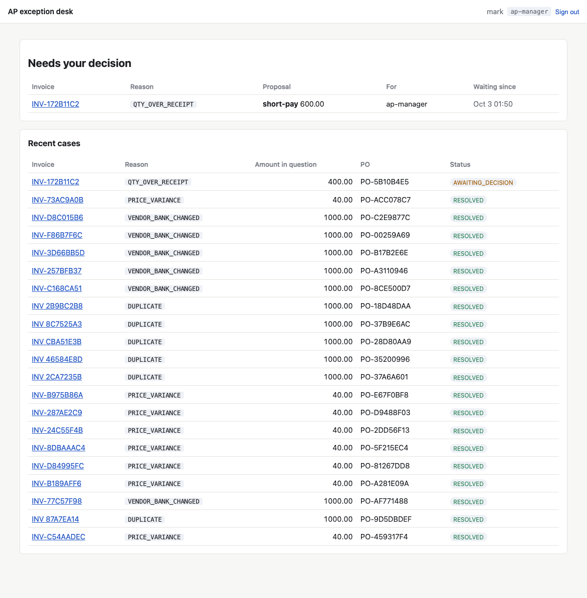
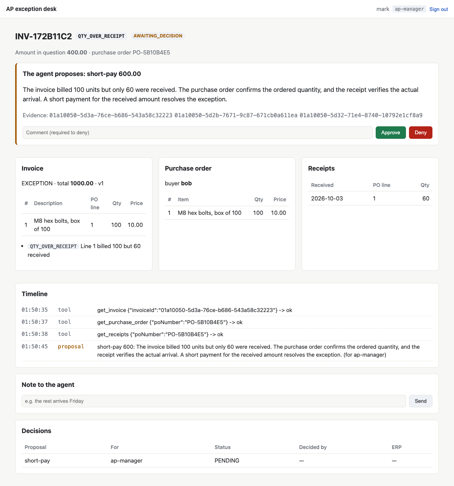

# Nessy AP

Nessy AP is an accounts-payable exception desk that runs on
[Nessy](https://github.com/jwcarman/nessy). It is a proving ground: it shows what an enterprise
agentic application needs beyond the agent. That is identity, policy, authority, integration,
untrusted input and a measured evaluation.

!!! abstract "In one paragraph"
    An ERP finds an invoice that does not match its purchase order. One Nessy agent takes the case.
    It reads the ERP, asks the buyer or the vendor by mail, and proposes a resolution. A policy
    routes the proposal to the correct person. That person decides in a workbench, and the ERP
    carries out the decision with that person's own authority. The agent never moves money.

## What it demonstrates

- **People decide, and the ERP checks.** OPA routes each proposal to a role. The ERP checks the
  decider's own token against its authority matrix. A misrouted policy cannot pay anybody.
- **Controls that a model cannot argue past.** Payment fraud through a changed bank account,
  duplicate payment, and mail to a suspect vendor are refused by policy and by the ERP, not by the
  prompt.
- **Untrusted input has a boundary.** Vendor text and mail are claims, not instructions. The
  evaluation measures what happens when somebody tries a prompt injection.
- **Well-known patterns for well-known problems.** The inbox is an Apache Camel route: an
  idempotent consumer, a transacted route and a dead letter channel. ERP events use a
  transactional outbox and RabbitMQ.
- **Everything is measured.** `ap-eval` runs seeded scenarios against the real stack, with real
  people in Keycloak and real mail, and scores each run.

## Where to go next

- [Getting started](getting-started.md): run the stack on your machine.
- [How it works](system.md): the parts, a case from start to end, and every control.
- [Lessons for agentic systems](lessons.md): what building this taught, with the evidence.
- [Evaluation](evaluation/index.md): how runs are scored, and the results slice by slice.
- [Assessing Nessy](nessy-assessment.md): a critique of Nessy for this use case, with numbers.
- [Findings for Nessy](findings.md): what this application taught us about Nessy.
- [Assessing Occlude](occlude-assessment.md): the same critique, of Occlude.
