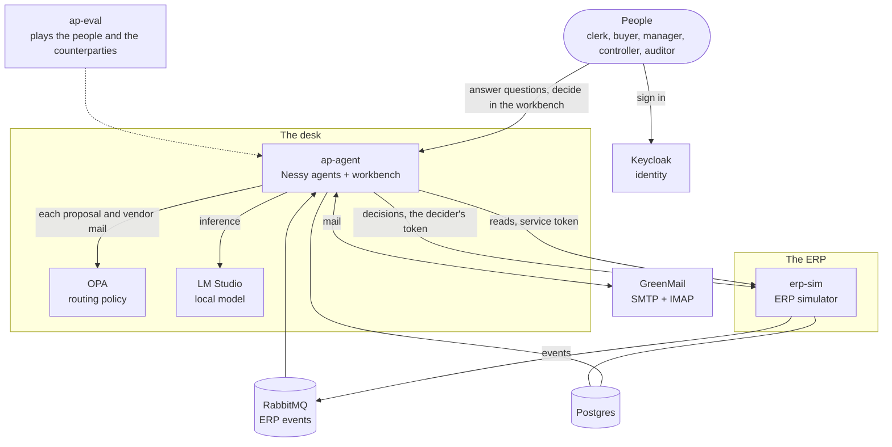
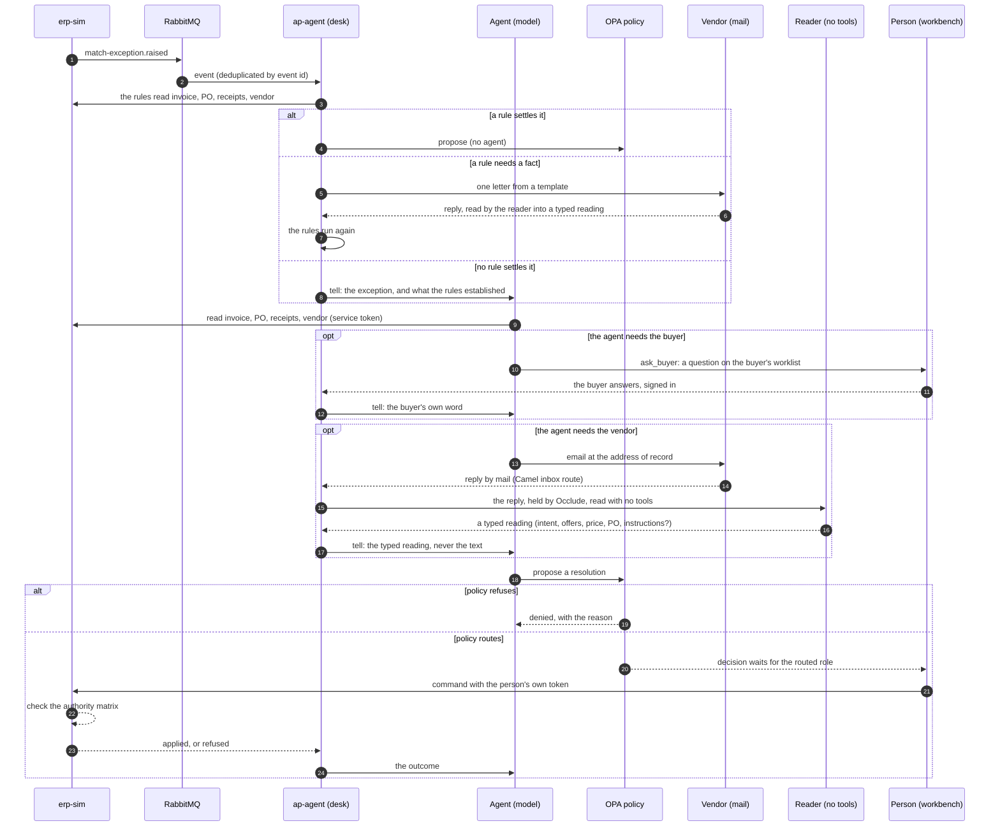
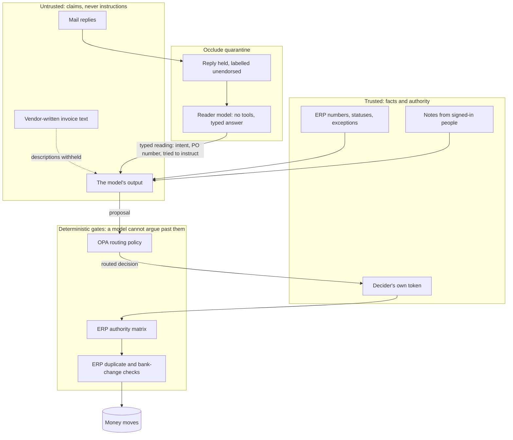

# The AP exception desk: the system as built

This page describes what nessy-ap does today: its parts, how a case moves through them, where trust
stops, and each control that keeps money safe. The design of record is
`docs/superpowers/specs/2026-10-02-ap-exception-desk-design.md`.

## 1. What it does

An accounts-payable (AP) team receives invoices. The ERP matches each invoice against its purchase
order (PO) and its goods receipts. When the match fails, the ERP raises a match exception. The
desk's rules look at each exception first. They read the ERP, ask the vendor for one fact when a
rule needs it, and propose a resolution. When no rule settles the case, the desk gives it to an
agent. The agent investigates, asks the buyer on the workbench or the vendor by mail when it needs
to, and proposes a resolution. A person with the correct authority decides each proposal, from
either one. The ERP carries out the decision as that person.

Neither the rules nor the agent moves money. They read, ask, and propose. See
[Stay deterministic as long as you can](deterministic-first.md) for why the rules come first.

## 2. The parts

| Part | What it is |
|---|---|
| `erp-sim` | A simulated ERP. It owns invoices, POs, receipts, vendors, the authority matrix and the audit. It publishes events through a transactional outbox. |
| `ap-agent` | The desk's rules: DMN decision tables (`decisions/resolution.dmn`), run in process by Apache KIE DMN. One Nessy agent per exception that the rules cannot settle, on Nessy's queued door, and one no-tools reader agent per vendor reply, on the direct door. It also serves the workbench (Thymeleaf) and a JSON API. Vendor mail is held by Occlude. All of Nessy's stored history is encrypted. |
| `ap-eval` | Runs seeded scenarios against the running stack and scores each run. |
| Keycloak 26.8 | Identity: users, roles and tokens. It holds no approval limits. |
| OPA 1.21 | The routing policy (`compose/opa/policy/ap.rego`). It decides who must decide a proposal, or refuses it. |
| RabbitMQ 4.3 | ERP events, on quorum queues, with a retry queue and a dead-letter queue. |
| GreenMail 2.1 | The mail server for the desk and the vendors. A buyer gets only a notice that a question waits on the workbench. |
| LM Studio | The models: `qwen/qwen3-coder-30b` for the agent and `google/gemma-4-e4b` for the reader, by default. |

## 3. A case from start to end

1. The ERP raises an exception and publishes `match-exception.raised`.
2. ap-agent reads the event. In one transaction, it records the event id, opens the case, and
   gives it to the desk's rules. A repeated event changes nothing.
3. The rules read the invoice, the PO, the receipts and the vendor from the ERP. Then one of
   three things happens:
   - A rule settles the case. The desk proposes the rule's resolution, and steps 6 to 8 follow.
     No agent works the case.
   - A rule needs a fact that the ERP does not hold. The desk writes one letter from a template to
     the vendor's contact of record. The reply goes through the quarantine and the reader. A reading
     that the ERP confirms becomes a fact, and the rules run again. A reading that the ERP does not
     confirm gives the case to the agent.
   - No rule settles the case. The desk tells the case's agent the exception and what the rules
     established. The rest of these steps are the agent's.
4. The agent reads the invoice, the PO, the receipts and the vendor.
5. If the agent needs the buyer, it asks on the workbench (`ask_buyer`). The question goes to the
   buyer the ERP names on a PO that belongs to the case's vendor, and a short notice mail tells
   the buyer it waits. The buyer answers signed in, and the answer reaches the agent as the
   buyer's own word. If the agent needs the vendor, it writes to the vendor's contact of record.
   The reply comes back by mail, is held by Occlude, and is read by a model with no tools into
   a typed reading. The agent gets the reading, never the text. While it waits, the case is
   `AWAITING_ANSWER`, and the invoice stays stopped by its exception. A hold that a person
   approves leaves the case `ON_HOLD`: the invoice is parked, the exception is still open, and
   new goods, a reply or the agent's next proposal moves it on.
6. The agent proposes a resolution: approve-variance, short-pay, hold, reject or
   request-credit-memo.
7. OPA routes the proposal to a role (clerk, buyer, AP manager or controller), or refuses it.
8. A person with that role decides in the workbench.
9. The workbench sends the command to the ERP with that person's own token. The ERP checks the
   person's authority again and applies the command, or refuses it.
10. The agent reads the outcome. A refusal or a denial is information, and the agent can propose
    again. Every turn ends with a move: a proposal, a question, or a letter. For a proposal from
    the rules, an applied decision resolves the case, and a declined one is a new fact: the rules
    run again.

The desk records every agent that works a case (its own agent, and each reader) and reports what
the case cost, per model, from Nessy's stored history (`/api/cases/{id}/usage`).

## 4. Where trust stops

| Input | Who controls it | How the desk treats it |
|---|---|---|
| ERP numbers, statuses, exceptions | The ERP | Facts. |
| Invoice line descriptions | The vendor | Withheld from the agent. People read them in the ERP. |
| Invoice and PO numbers as written on the invoice | The vendor | Claims, shown as text. The ERP checks only that the invoice number is not blank (see §7). |
| Mail replies | Anyone who can send mail | Held by Occlude, labelled unendorsed. The agent never reads the text. A model with no tools reads each reply into a typed reading: intent, a PO number of the ERP's shape, and whether the mail tried to give instructions. A PO number is trusted only when the ERP holds it for the case's vendor. People who work cases read the mail on the workbench, and each read is in Occlude's record. Mail that answers no case is held the same way, for managers. |
| Notes from the workbench | Signed-in people with a deciding role | Instructions from the team. |
| Answers to the agent's questions | The person asked, signed in on the workbench | That person's own word. Only the person asked may answer, once. The question goes to the buyer the ERP names on a PO that belongs to the case's vendor. |
| The model's output | The model | Proposals only. They have no authority. |

## 5. The controls

Each control has a place where it is enforced. Policy and the ERP enforce the controls that keep
money safe, because a model can be persuaded.

| Control | Enforced by | What it prevents | Proof |
|---|---|---|---|
| The agent cannot move money | Tool design: no ERP command tool | Any payment without a person | Tool list; slice 2 |
| Each decision needs the routed role | OPA routing + workbench check | A person deciding outside their role | `PolicyRoutingTest`, `ap_test.rego` |
| Authority by amount and action | ERP authority matrix, with the decider's own token | A misrouted or forged approval | `AuthorityMatrixTest`; eval: misrouted policy refused 3/3 in enforce mode |
| Service tokens only read | ERP security | The agent's own token writing to the ERP | `ErpSecurityTest` |
| Unverified bank change: no payment, no vendor mail | OPA (payments, credit memos, vendor mail) + ERP (payments) | Payment fraud through a changed account | `bank-change-fraud`: 40 of 40 on slice 10 |
| A bank change needs a call-back and a second person | ERP vendor master | One person approving their own fraud | `BankChangeVerificationTest` |
| A repeated invoice number is never paid from the desk | OPA (any open `DUPLICATE` on the invoice) + ERP (refuses approval while one is open) | Duplicate payment, also when an injection argues for it | `injected-invoice`: 5 of 5 paid without the control, 0 of 5 with it; 40 of 40 on slice 10 |
| A possible duplicate is paid only by the controller | OPA | A second shipment billed alike, paid without a senior check | `possible-duplicate`: 39 of 40 on slice 10 (the failure was a mistyped citation) |
| Unknown facts are refused, never read as safe | OPA defaults | A failed read treated as "no fraud" | `ap_test.rego` |
| A tool the policy does not name is refused | OPA allowlist; every tool the agent has is bound to the policy | An app newer than its policy, failing open | [Slice 5](evaluation/how-the-desk-evolved.md#slice-5-a-policy-that-failed-open); `ap_test.rego` |
| Mail goes only to addresses of record, at most 3 per case per recipient | `MailTools` | Mail to an attacker's address; mail floods | `MailToolsTest` |
| A case whose mail tried to give instructions cannot move money | OPA (`instructionsSeen` from the case's integrity label) | A persuasive reply turning into a payment | `injected-reply`: 40 of 40 held on slice 10; `ap_test.rego` |
| Untrusted mail is never in the agent's context or in plaintext at rest | Occlude (labels, reveals, record); Nessy's storage codec (AES-256-GCM, a key of its own) | Prompt injection through mail; a database copy of vendor text | `QuarantineDeclarationsTest`, `ReaderWiredTest` |
| A proposal may cite only ids a tool returned | OPA (`ungroundedCitations` from `Grounding`: only whole ids in a successful tool result count), which names each one so the agent corrects it; the workbench still warns as a second line | An approver trusting an id the agent made up or copied wrongly | `GroundingGateTest`, `GroundingTest`, `ap_test.rego` |
| Nobody approves a decision that changes nothing | OPA (a hold on an invoice already on hold is refused) | People's time spent on no-ops; a case stranded by an ERP refusal | `ap_test.rego`, `PolicyRoutingTest` |
| One question waits per case, and only the person asked may answer, once | Postgres (a unique partial index) and `Answers` (row lock) | A buyer flooded with questions; an answer from the wrong person | `QuestionsTest`, `QuestionAnswerTest` |
| Each inbox message is handled once and never blocks the inbox | Camel route: idempotent consumer, transacted, dead letter channel | Double replies; one bad message stopping all mail | `DeskInboxRouteTest`, `DeskInboxDeadLetterTest` |
| Mail that answers nothing the desk sent, and names no case, never reaches a case | The inbox route: a reply joins a case by a Message-ID the desk sent or by the case's subject token; the rest is set aside for a manager. Mail with a token from someone the desk never wrote to joins the case marked as such, and still goes through the quarantine | A fraudster's unprompted bank change | `CounterpartyTest`, `DeskInboxRouteTest`; `unsolicited-bank-change` |
| Every Occlude refusal reaches the log | `RefusalLog`, a Spring `@EventListener` on Occlude's `RefusalEvent` | A gate refusing quietly, as the first reader failure did | `RefusalLogTest` |
| No proposal in a turn that asked someone | OPA (`askedThisTurn` from the case) | An agent that invents the answer it is waiting for | `AskThenWaitTest`, `ap_test.rego` |
| Vendor-written text reaches the agent only as a checked reference, or not at all | The desk: `VendorReference` for invoice and PO numbers, also where the ERP's summary quotes them; line descriptions and the address a bank change came from are withheld | An instruction hidden in a field nobody reads as instructions | `VendorReferenceTest`, `CaseInputRendererTest`, `InvestigateToolsTest` |
| A case that stops with nothing in motion goes to a person | The desk (`NeedsPerson`, on turn narration) | A case nobody is acting on | `NeedsPersonTest` |
| The rules settle a case only when exactly one row matches known facts | DMN hit policies (UNIQUE for the resolution, COLLECT for the facts needed); an unknown fact matches no row | A guess where the rules do not apply; two rules that disagree | `ResolverTest` |
| A proposal from the rules goes through the same policy and the same decider as the agent's | `ResolverDesk` uses the routing approver and the facts enricher | A wrong decision-table row authorizing what the policy forbids | `ResolverDeskTest` |
| A vendor's answer becomes a fact only from the vendor the desk wrote to, and only when it names the invoice line's item | `ResolverDesk` and `DeskMail` | A reply from someone else, or about a different item, supplying a fact | `ResolverDeskTest` |
| The rules propose only on facts the desk read | `CaseSlots` (`complete`), `ResolverDesk` | A hold or short-pay proposed after a failed ERP read | `ResolverDeskTest` |
| Vendor-written text the rules pass on is shaped like a reference | `ResolverDesk` (the billed item), `CaseInputRenderer` (text the ERP quotes in its summary) | An instruction in an item code reaching the agent | `ResolverDeskTest`, `CaseInputRendererTest` |
| Every run the rules settle of one scenario ends in the same action | The evaluation's determinism check | Rules that depend on something they should not | `ReportTest`; the evaluation report |

### The desk's inbox route

The inbox is an Apache Camel route (`DeskInboxRoute`). Each box is a named Enterprise
Integration Pattern.

- The consumer marks a message seen only when its exchange completes.
- If a step fails, the dead letter channel sets the message aside in a separate transaction. Then it
  rolls back the failed work: the idempotent key, the timeline line and the tell. The message is
  marked seen, so it does not block the inbox.
- Camel's thread pools use virtual threads. camel-spring-boot copies Boot's
  `spring.threads.virtual.enabled` into Camel's own setting.

## 6. Rulings that a person may change

- **Duplicates (a judgement call for the demo).** An exact invoice-number match is never paid. The
  same PO and total within the window is paid only by the controller. A CFO may want different
  rules.
- **The authority matrix (spec §2.5).** Clerks may hold and request credit memos. Buyers may
  approve price variances on their own POs up to 10,000. The AP manager may do any action up to
  10,000. The controller may do any action at any amount.

## 7. Known gaps

- **Vendor-written numbers are free text.** The invoice number and the PO number as written on an
  invoice reach the agent as text. The ERP checks only that the invoice number is not blank.
- **A flagged case is settled outside the desk.** When a reply tries to give instructions or
  claim an approval, or cannot be read at all, the desk will not move money on that case again.
  Nothing in the desk lowers the flag; a person settles the invoice in the ERP.
- **Stored history is never expired.** Nessy keeps every agent's history, encrypted, with no
  retention rule (Nessy finding F13).
- **A turn that fails leaves its case with nobody acting.** When the model server drops a request,
  Nessy ends the turn (finding F15), and nothing puts the case in front of a person. The
  workbench shows the case as investigating.
- **No reminder for an unanswered question.** A case that waits on a silent person waits; the
  workbench shows on whom.
- **The eval's approver approves**, except where a scenario scripts a denial. A real approver
  sees the evidence and the warning for any citation the agent never read.
- **The desk's rules stand in for rules the ERP does not have.** In a real company, the rules that
  the ERP's own data decides belong in the ERP. The simulator keeps them in the desk.
- **The reader reads a money-moving fact once.** The design reads it twice and treats a
  disagreement as unknown. Today the only cross-check is the ERP's.
- **A crash between a decision and the rules' next step leaves the case with nobody acting.** The
  rules act after the decision commits; no sweeper finds a case that stopped between the two.
- **The rules' letter to a vendor is sent inside the event's transaction.** A rollback after the
  send, and the redelivery that follows, sends it twice.
- **KIE DMN warns at startup on Java 25.** XStream, which KIE uses, calls a deprecated
  `sun.misc.Unsafe` method, and the JVM prints a warning.
- **Not tested yet:** an approval that expires during a decision, a restart between proposal and
  decision, and outages of mail, OPA or Postgres.

## 8. How to run it

See [Getting started](getting-started.md).
